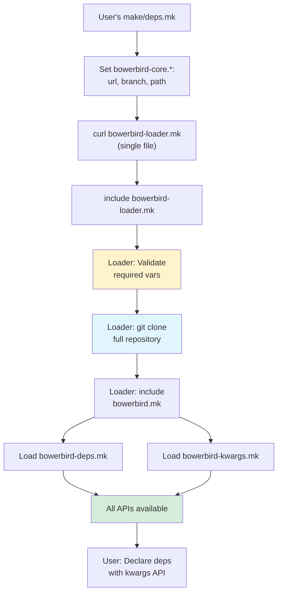

# Bowerbird Core Consolidation and Loader

```
Status:   Implemented
Project:  make-bowerbird-core
Created:  2026-01-15
Accepted: 2026-01-16
Implemented: 2026-01-16
Author:   Bowerbird Team
```

---

## Summary

Consolidate `make-bowerbird-deps` and `make-bowerbird-libs` into a unified `make-bowerbird-core` repository, eliminating the chicken-and-egg problem at the architectural level. Include a git-based loader that clones the full repository, making all core functionality (dependency management and kwargs parsing) immediately available.

## Problem

The current architecture creates fundamental issues:

### 1. Chicken-and-Egg Problem

- `make-bowerbird-deps` provides dependency management with kwargs API
- Kwargs API requires `make-bowerbird-libs` for argument parsing
- But `bowerbird-libs` must be loaded as a dependency itself
- This forces users to use low-level positional API for all dependencies

### 2. Artificial Separation

- `bowerbird-libs` exists solely to support `bowerbird-deps`
- No other repos use `bowerbird-libs` independently
- Tight coupling between repos but managed separately
- Two repos, two versions, manual compatibility management

### 3. Poor User Experience

- Users must bootstrap two separate systems
- Forced to use verbose low-level API (`git-dependency-low-level`)
- Clean kwargs API unavailable when needed most
- 17+ lines of repetitive boilerplate

### 4. Maintenance Overhead

- Two repos to version and release
- Coordination required for compatible versions
- Duplicate development infrastructure
- More complex dependency graph

## Proposed Solution

### Part 1: Repository Consolidation

**Create `make-bowerbird-core`** combining:
- Dependency management from `make-bowerbird-deps`
- Kwargs parsing from `make-bowerbird-libs`
- All functionality in single cohesive package

**Structure:**
```
make-bowerbird-core/
  src/
    bowerbird-deps/
      bowerbird-deps.mk        # Dependency management (from make-bowerbird-deps)
    bowerbird-kwargs/
      bowerbird-kwargs.mk      # Kwargs parsing (from make-bowerbird-libs)
  test/
    bowerbird-deps/            # 27 tests (dependency tests)
    bowerbird-kwargs/          # 2 tests (kwargs tests)
    makefile/                  # 1 test (makefile utilities)
  bowerbird-loader.mk          # Bootstrap loader (at root)
  bowerbird.mk                 # Main entry point (includes kwargs + deps)
```

### Part 2: Git-Based Loader

**Loader at root** (`bowerbird-loader.mk`):
- Curled by user as single bootstrap file
- Clones full `make-bowerbird-core` repository via git
- All functionality immediately available
- No chicken-and-egg problem

**Key Design:**
```makefile
# bowerbird-loader.mk
bowerbird-core.url ?= $(error ERROR: bowerbird-core.url must be set)
bowerbird-core.branch ?= $(error ERROR: bowerbird-core.branch must be set)
bowerbird-core.path ?= $(error ERROR: bowerbird-core.path must be set)

# Clone full repository
$(bowerbird-core.path)/.git:
	@git clone --branch $(bowerbird-core.branch) \
		$(bowerbird-core.url) $(bowerbird-core.path)

# Include main entry point
-include $(bowerbird-core.path)/bowerbird.mk
```

## User Experience

### Before (Current Architecture)

**17 lines, forced low-level API:**

```makefile
WORKDIR_DEPS ?= $(error ERROR: Undefined variable WORKDIR_DEPS)

# Bootstrap bowerbird-deps
BOWERBIRD_DEPS.MK := $(WORKDIR_DEPS)/bowerbird-deps/bowerbird_deps.mk
$(BOWERBIRD_DEPS.MK):
	@curl ... bowerbird-deps.mk
include $(BOWERBIRD_DEPS.MK)

# Must use low-level API (kwargs not available)
$(call bowerbird::core::git-dependency-low-level,bowerbird-libs,$(WORKDIR_DEPS)/bowerbird-libs,https://github.com/asikros/make-bowerbird-libs.git,main,,bowerbird.mk)
$(call bowerbird::core::git-dependency-low-level,bowerbird-help,$(WORKDIR_DEPS)/bowerbird-help,https://github.com/asikros/make-bowerbird-help.git,main,,bowerbird.mk)
$(call bowerbird::core::git-dependency-low-level,bowerbird-test,$(WORKDIR_DEPS)/bowerbird-test,https://github.com/asikros/make-bowerbird-test.git,main,,bowerbird.mk)
```

### After (Consolidated Architecture)

**12 lines, kwargs API available:**

```makefile
WORKDIR_DEPS ?= $(error ERROR: Undefined variable WORKDIR_DEPS)

# Bootstrap bowerbird-core
bowerbird-core.path ?= $(WORKDIR_DEPS)/bowerbird-core
bowerbird-core.url ?= https://github.com/asikros/make-bowerbird-core.git
bowerbird-core.branch ?= main
bowerbird-core.entry ?= bowerbird.mk

$(WORKDIR_DEPS)/bowerbird-loader.mk:
	@curl -sSfL --create-dirs -o $@ \
https://raw.githubusercontent.com/asikros/make-bowerbird-core/$(bowerbird-core.branch)/bowerbird-loader.mk

include $(WORKDIR_DEPS)/bowerbird-loader.mk

# Kwargs API works immediately!
$(call bowerbird::core::git-dependency, name=bowerbird-help, url=https://github.com/asikros/make-bowerbird-help.git, branch=main, entry=bowerbird.mk)
$(call bowerbird::core::git-dependency, name=bowerbird-test, url=https://github.com/asikros/make-bowerbird-test.git, branch=main, entry=bowerbird.mk)
```

## Alternatives Considered

### Alternative 1: Keep Separate, Add Loader Workaround

**Approach:** Keep deps and libs separate, create loader to manage both.

**Rejected because:**
- Doesn't solve root cause (chicken-and-egg still exists)
- Adds complexity (loader as band-aid)
- Still two repos to maintain
- Artificial separation remains

### Alternative 2: Inline Kwargs in Deps

**Approach:** Copy kwargs code directly into bowerbird-deps.mk.

**Rejected because:**
- Loses modularity
- Makes code harder to test independently
- No clear separation of concerns
- Still awkward for adding future utilities

### Alternative 3: Make Libs the Base

**Approach:** Put dependency management into bowerbird-libs instead.

**Rejected because:**
- Confusing naming (libs doesn't imply dependency management)
- Dependency management is the primary use case
- Would require renaming anyway

### Alternative 4: Curl Multiple Files

**Approach:** Loader curls both deps.mk and kwargs.mk separately.

**Rejected because:**
- Fragile (multiple network calls)
- Version skew risk (files from different commits)
- Doesn't scale (what if we add more modules?)
- Git clone is more robust

## Trade-offs

### Benefits

1. **No chicken-and-egg**: Problem solved at architecture level
2. **Simpler mental model**: One core repo, one version
3. **Better UX**: Kwargs API available immediately
4. **Easier maintenance**: Single repo, single release cycle
5. **Version consistency**: All components guaranteed compatible
6. **Robust bootstrap**: Git clone ensures atomic, consistent state
7. **Full repo access**: Tests, docs, examples all available
8. **Future-proof**: Easy to add more core utilities

### Costs

1. **Breaking change**: Existing projects must migrate
2. **Larger clone**: Full repo instead of single file (mitigated: clones once, cached)
3. **Git dependency**: Requires git (already required for dependency management)
4. **Migration effort**: Update all bowerbird repos

### Performance Implications

- **Initial clone**: ~200KB repo vs ~20KB single file (one-time cost)
- **Subsequent builds**: No difference (cached locally)
- **Network**: Git clone more robust than multiple curls
- **Disk**: Minimal impact (<1MB)

### Maintenance Implications

- **Reduced overhead**: One repo instead of two
- **Simpler releases**: Single version number
- **Easier testing**: All components tested together
- **Clear ownership**: One place for core functionality

## Implementation Plan

### Phase 1: Create Core Repository

1. Create `make-bowerbird-core` repository
2. Set up standard bowerbird structure
3. Copy kwargs implementation from libs
4. Copy dependency management from deps
5. Create unified entry point (`bowerbird-core.mk`)
6. Create loader (`bowerbird-loader.mk`)

### Phase 2: Migrate Proposals

1. Copy proposals from deps and libs
2. Renumber by date (01 = oldest)
3. Update project field to "make-bowerbird-core"
4. Create proposal index

### Phase 3: Testing

1. Copy and adapt tests from both repos
2. Ensure kwargs tests pass
3. Ensure dependency tests pass
4. Add integration tests
5. Test loader functionality

### Phase 4: Documentation

1. Create comprehensive README
2. Document consolidation rationale
3. Provide migration guide
4. Update CHANGELOG
5. Create DEVELOPMENT guide

### Phase 5: Migration

1. Update one example repo (e.g., make-bowerbird-help)
2. Verify migration works
3. Create migration guide
4. Gradually update other repos
5. Deprecate old repos

### Phase 6: Deprecation

1. Mark `make-bowerbird-deps` as deprecated
2. Mark `make-bowerbird-libs` as deprecated
3. Add deprecation notices to READMEs
4. Point to `make-bowerbird-core`
5. Eventually archive old repos

## Migration Path

### For Existing Projects

**Step 1: Update bootstrap code**

Replace:
```makefile
# Old: Bootstrap deps + libs separately
BOWERBIRD_DEPS.MK := $(WORKDIR_DEPS)/bowerbird-deps/bowerbird_deps.mk
$(BOWERBIRD_DEPS.MK):
	@curl ... bowerbird-deps.mk
include $(BOWERBIRD_DEPS.MK)

$(call bowerbird::core::git-dependency-low-level,bowerbird-libs,...)
```

With:
```makefile
# New: Bootstrap core with loader
bowerbird-core.path ?= $(WORKDIR_DEPS)/bowerbird-core
bowerbird-core.url ?= https://github.com/asikros/make-bowerbird-core.git
bowerbird-core.branch ?= main
bowerbird-core.entry ?= bowerbird.mk

$(WORKDIR_DEPS)/bowerbird-loader.mk:
	@curl -sSfL --create-dirs -o $@ \
https://raw.githubusercontent.com/asikros/make-bowerbird-core/$(bowerbird-core.branch)/bowerbird-loader.mk

include $(WORKDIR_DEPS)/bowerbird-loader.mk
```

**Step 2: Convert dependencies to kwargs API**

Replace:
```makefile
$(call bowerbird::core::git-dependency-low-level,bowerbird-help,$(WORKDIR_DEPS)/bowerbird-help,https://github.com/asikros/make-bowerbird-help.git,main,,bowerbird.mk)
```

With:
```makefile
$(call bowerbird::core::git-dependency, name=bowerbird-help, url=https://github.com/asikros/make-bowerbird-help.git, branch=main, entry=bowerbird.mk)
```

**Step 3: Test**

```bash
make clean
make check
```

### Breaking Changes

- Repo name changes from `make-bowerbird-deps` to `make-bowerbird-core`
- Bootstrap process changes (git clone instead of individual file downloads)
- Namespace remains compatible (`bowerbird::core::*`, `bowerbird::lib::*`)

## Bootstrap Flow



## Files Changed

### New Repository: make-bowerbird-core

**Created:**
- `bowerbird-loader.mk` (root)
- `bowerbird.mk` (entry point)
- `src/bowerbird-core/bowerbird-core.mk`
- `src/bowerbird-core/bowerbird-deps.mk` (from deps)
- `src/bowerbird-core/bowerbird-kwargs.mk` (from libs)
- `development/proposals/accepted/01-dependency-override.md` (migrated)
- `development/proposals/draft/02-core-consolidation-and-loader.md` (this)
- `README.md`
- `CHANGELOG.md`
- `DEVELOPMENT.md`
- Standard structure (make/, test/, etc.)

### Deprecated Repositories

- `make-bowerbird-deps` → Add deprecation notice
- `make-bowerbird-libs` → Add deprecation notice

## Open Questions

1. **Timing:** When to deprecate old repos?
   - **Suggested:** After 2-3 releases with deprecation warnings

2. **Versioning:** Start at v1.0.0 or v0.1.0?
   - **Suggested:** v1.0.0 since consolidating mature components

3. **Backwards compatibility:** Keep old repos as stubs that redirect?
   - **Suggested:** Yes, for transition period

4. **Git vs HTTPS:** Support both SSH and HTTPS URLs?
   - **Suggested:** Yes, user provides URL

## Success Criteria

- [ ] Core repo created with proper structure
- [ ] Loader successfully clones and loads repository
- [ ] Kwargs API works immediately after loader inclusion
- [ ] All tests from deps and libs pass in core
- [ ] Documentation is clear and complete
- [ ] At least one repo successfully migrated
- [ ] No regressions in existing functionality
- [ ] Migration guide tested and verified

## Future Enhancements

Once consolidated, easier to add:
- Additional utility functions (string manipulation, list operations)
- Logging/debugging helpers
- Configuration management
- Build system helpers
- All in one cohesive package with guaranteed compatibility
